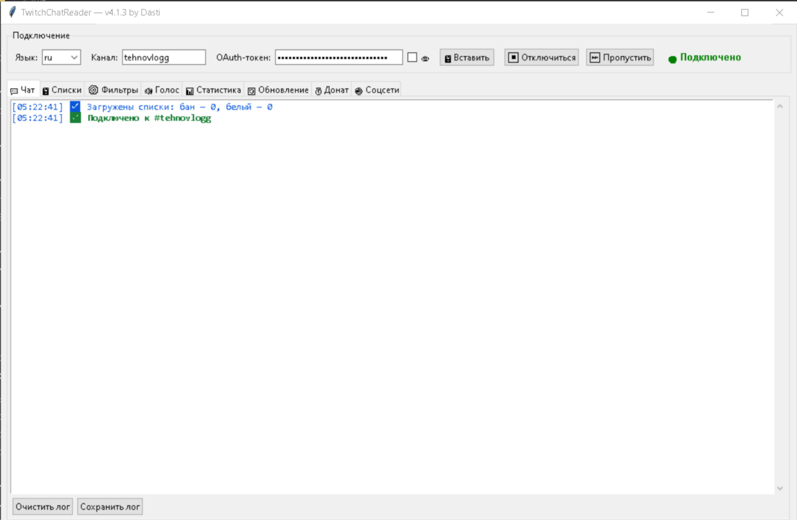
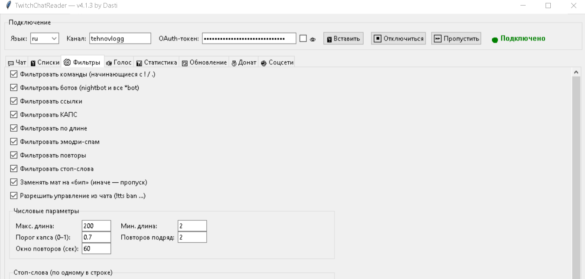
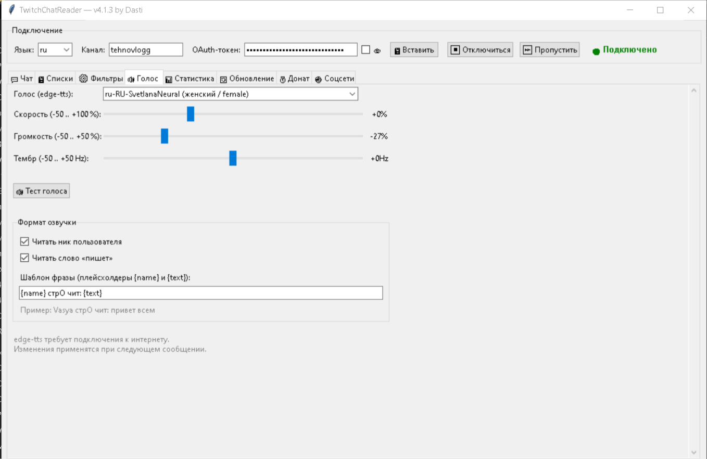
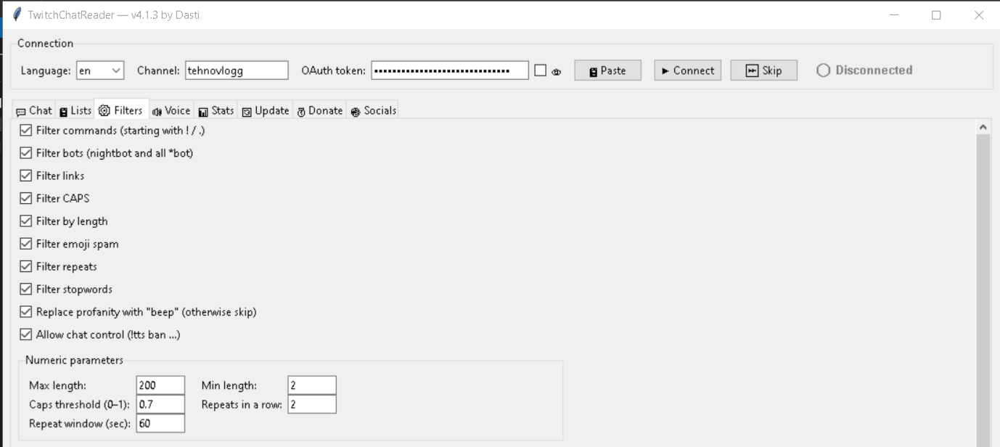

# Twitch TTS Chat Bot

Reads Twitch chat aloud using neural voices from Microsoft Edge. Comes with a GUI, filters, black/white lists, and stats.

## Requirements

- Python 3.10 or newer
- Internet connection
- Windows / macOS / Linux

## Installation

1. Install Python 3.10+ from https://www.python.org/downloads/
   - On Windows, check **"Add Python to PATH"** during installation.

2. Open a terminal and install dependencies:

pip install edge-tts playsound3

3. Get an OAuth token:
- Go to https://twitchtokengenerator.com/
- Log in, choose **Custom Scope**, select `chat:read`
- Click **Generate Token** and copy the **Access Token**

4. Run the bot:

python tts_chat.py

5. In the app:
- Type your channel name (lowercase, no `#`)
- Paste the token (use the 📋 button or Ctrl+V)
- Click **▶ Connect**

## Chat Commands

Only the broadcaster and moderators can use these:

| Command | Description |
|---|---|
| `!tts ban <user>` | Mute a user |
| `!tts unban <user>` | Unmute a user |
| `!tts allow <user>` | Always read this user |
| `!tts deny <user>` | Remove from whitelist |
| `!tts list` | Show both lists |
| `!tts help` | Show command help |

## Files

- `tts_config.json` — settings (do not share, contains your token)
- `tts_lists.json` — blacklist and whitelist

## Troubleshooting

**`ModuleNotFoundError: No module named 'edge_tts'`**

python -m pip install edge-tts

**`ModuleNotFoundError: No module named 'playsound3'`**

python -m pip install playsound3

**No sound on Linux**

Install an MP3 player:

sudo apt install mpv

**`pip install edge-tts` fails with "Could not find a version"**

Your Python is too old. edge-tts requires Python 3.7+. Upgrade to 3.10 or newer.

## License

MIT

## Screenshots / Скриншоты

<table>
  <tr>
    <th>1 / 1</th>
    <th>2 / 2</th>
    <th>3 / 3</th>
    <th>4 / 4</th>
  </tr>
  <tr>
    <td></td>
    <td></td>
    <td></td>
    <td></td>
  </tr>
  <tr>
    <th>1 / 1</th>
    <th>2 / 2</th>
    <th>3 / 3</th>
    <th>4 / 4</th>
  </tr>
  <tr>
    <td></td>
    <td></td>
    <td></td>
    <td></td>
  </tr>
</table>